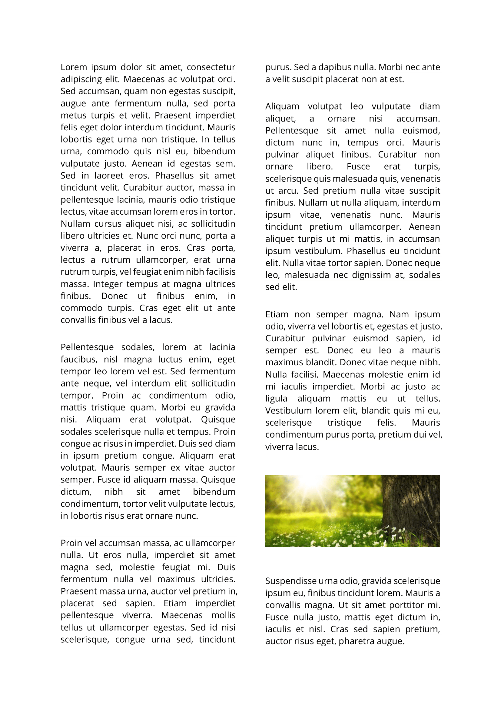
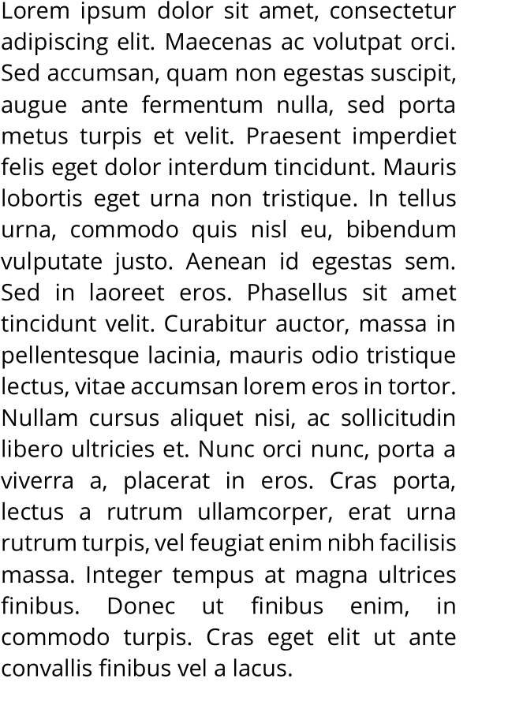
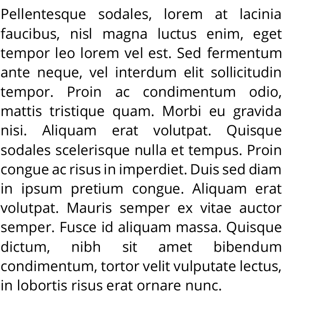
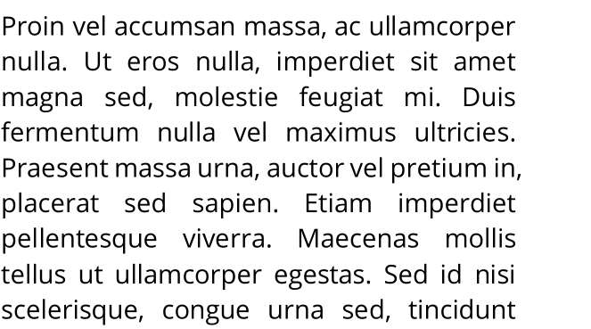
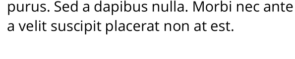
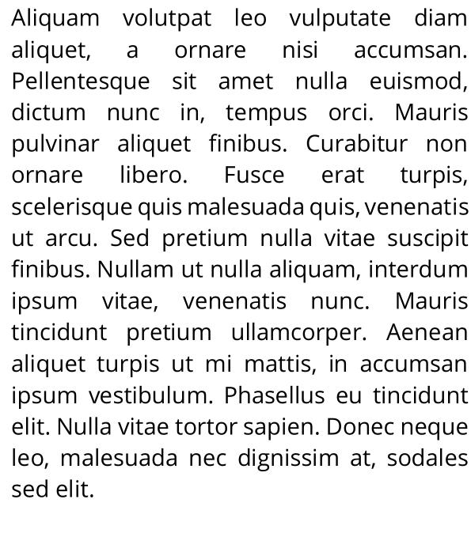
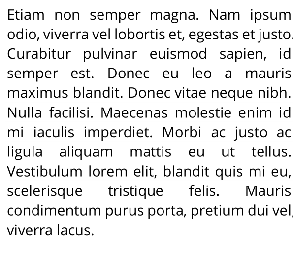
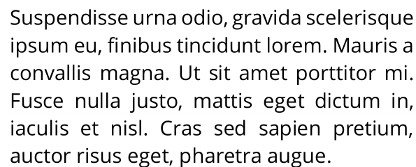

# ParagraphsExtraction
Identify and extract all the paragraphs from the papers image collected(.png), and sort them in the correct order (required for double-column and triple-column papers) by image processing techniques. 

### Packages and libraries allowed to use: 
1. Python Standard (list)
2. OpenCV
3. NumPy
4. Matplotlib

### Input: 

### Output: 
| |Output Image|
| ------------- |:-------------:|
|Column 1 Paragraph 1||
|Column 1 Paragraph 2||
|Column 1 Paragraph 3||
|Column 2 Paragraph 1||
|Column 2 Paragraph 2||
|Column 2 Paragraph 3||
|Column 2 Paragraph 4||